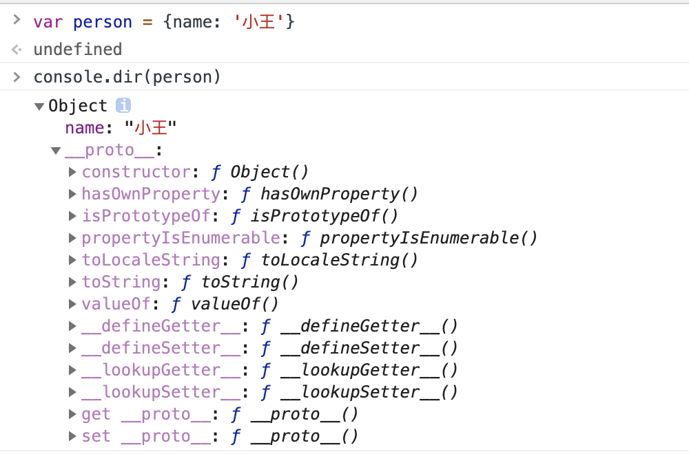
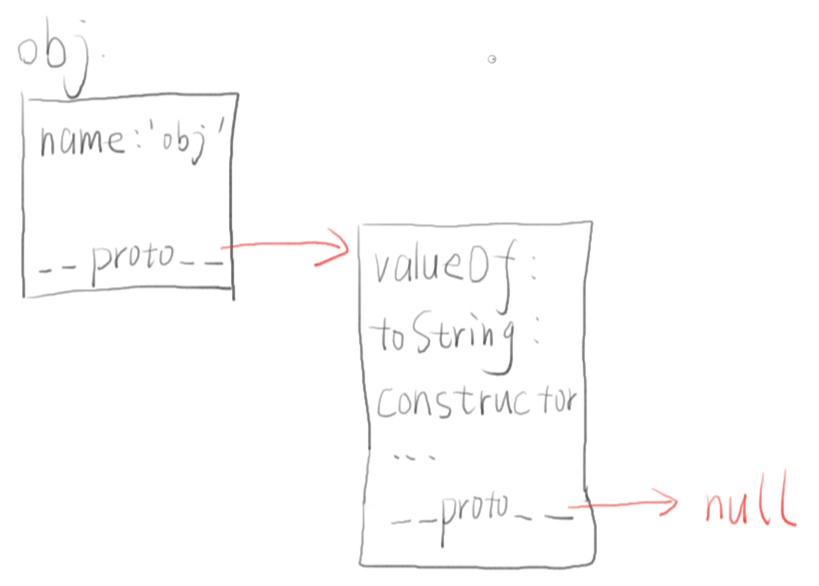
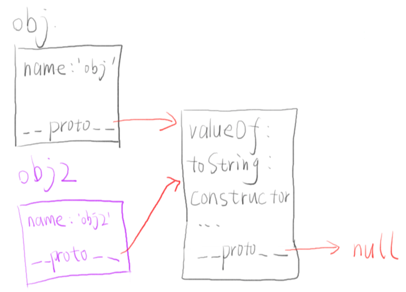

在 js 中，我们最常打交道的就是对象，比如

```js
var person = {
  name: '小王'
};
```

我们可以对`person`进行一些操作，包括：

1. 【读】属性
2. 【新增】属性
3. 【更新】属性
4. 【删除】属性

而使用最频繁的就是读和新增了，类如`person.name`就是读，`person[age]=23`就是新。

在我们对`person`进行额外操作前，我们在浏览器控制台看看它是什么样的



很惊奇地看到，`person`除了有我们主动写的属性，还有其他的属性和方法，比如图中的`constructor`，`valueOf`和`toString`。

那么问题就来了，**我们并没有给`person`写这些属性和方法，它们是怎么来的呢？**

## 找找原型链

根据控制台`console.dir()`的显示结果，我们来整理一波

先手画一个示意图理解下



我们可以整理出

1. `person` 本身有一个属性 `name`（这是我们给它加的）
2. `person` 还有一个属性叫做 `__proto__`（它是一个对象
3. `person.__proto__` 有很多属性，包括 `valueOf`、`toString`、`constructor` 等
4. `person.__proto__` 其实也有一个叫做 `__proto__` 的属性，值为 null

那回到我们的问题：为什么`person`会有`constructor`、`valueOf`、`toString`这几个属性呢？

答案就是，跟`__proto__`相关。

当我们在 js 里，使用`person.toString()`的时候，js 引擎就会做下面的事情：

1. 看看 `person` 对象本身有没有 `toString` 属性。没有就走到下一步。
2. 看看 `person.__proto__` 对象有没有 toString 属性，发现 `person.__proto__` 有 toString 属性，于是找到了

所以`person.toString`实际上就是第 2 步中找到`obj.__proto__.toString`。

那么我们可以继续推理：

3. 如果`person.__proto__`没有，那么浏览器会继续查看 `person.__proto__.__proto__`
4. 如果`obj.__proto__.__proto__`也没有，那么浏览器会继续查看`obj.__proto__.__proto__.proto__`
5. 直到找到 `toString` 或者 `__proto__` 为 null。

以上这个一层一层查找的过程，就像是在`__proto__`组成的一条链子查找，这个链子，就被称之为**原型链**

## 共享原型链

我们现在又写了另外一个对象

```js
var person2 = {
  name: '小李'
};
```

那现在链子的情况是怎样的了？我们再来画画示意图



那么可以看到，`person.toString`和`person2.toString`指向的是同一个东西，也就是`person.__proto__.toString`。所以当我们改变`person.__proto__.toString`的值时，`person2.toString`也会发生改变。这就是原型链的便捷之处，让不同的对象，只要有同样的原型，便可使用一些同样的属性和方法。

假如我们想让`person2.toString`和`person.toString`不同，得怎么操作呢？直接赋值就好了

```js
person2.toString = function() {
  return 'person2的toString';
};
```

这样`peron2.toString`就不会去查找原型链的，而是直接使用自己的。

## 小结

js 中的原型链是通过对象的`__proto__`（浏览器实现的）属性一层一层链接起来的，对象读取属性或方法时，会沿着这个链子一层一层往上找。原型链给 js 对象有了复用属性和方法的便捷性。
