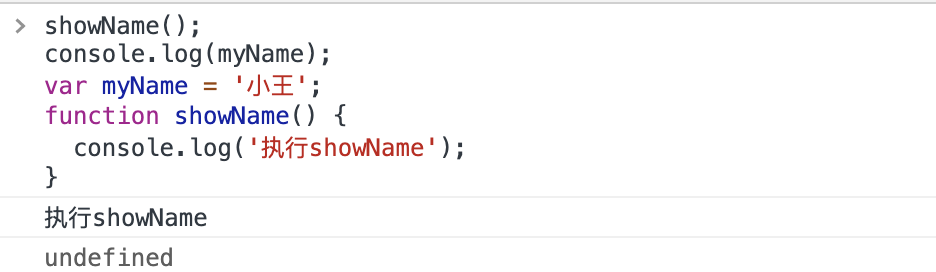

js 中的变量提升，一直是个让新手迷惑的点，少不留声，就可能写出不符合预期的代码。

来看一段代码

```js
showName();
console.log(myName);
var myName = '小王';
function showName() {
  console.log('执行showName');
}
```

若是 js 是按照顺序执行的，以上代码应该会报错，因为

- 执行到第 1 行的时候，由于函数 `showName` 还没有定义，执行应该会报错
- 执行第 2 行的时候，由于变量 `myName`也未定义，同样也会报错

实际上在浏览器执行，却发现`showName`可以正常使用，而`console.log(myName)`也未报错，只是打印出了`undefined`



之所以出现这个现象，就是由于 js 的变量提升(Hoisting)引起的。

在解释变量提升之前，先要好好了解一下，js 中的声明和赋值。

对于`var myName = '小王'`这行代码来说，它其实同时包含了声明和赋值，可当作如下两行代码来理解

```js
//  变量声明
var myName;
//  变量赋值
myName = '小王';
```

上面介绍了**变量的声明和赋值**，那函数的呢，来看看如下代码

```js
function foo() {
  console.log('foo');
}
var bar = function() {
  console.log('bar');
};
```

第一个`foo`是完整的函数声明，也就是说没有涉及到赋值操作；第二个`bar`是先声明变量`bar`，再把`function(){console.log(bar)}`赋值给了`bar`。所以以上代码按照声明和赋值的角度去理解，应该是这样的

```js
// foo函数，完整的函数声明
function foo = function() {
  console.lof('foo')
}
//  bar函数，先声明变量
var bar;
bar = function() {
  console.log('bar')
}
```

在理解来什么是声明和赋值的前提下，我们就可以讨论什么是变量提升了。

**所谓的变量提升，是指在 JavaScript 代码执行过程中，JavaScript 引擎把变量的声明部分和函数的声明部分提升到代码开头的“行为”。变量被提升后，会给变量设置默认值，这个默认值就是我们熟悉的 undefined。**

这就能解释开头那段代码的输出了。

从概念的字面意义上来看，“变量提升”意味着变量和函数的声明会在物理层面移动到代码的最前面，正如我们所模拟的那样。但，这并不准确。实际上变量和函数声明在代码里的位置是不会改变的，而且是在编译阶段被 JavaScript 引擎放入内存中。对，没听错，一段 JavaScript 代码在执行之前需要被 JavaScript 引擎编译，编译完成之后，才会进入执行阶段。大致流程是这样的：

一段 js 代码 =》 编译阶段 =》 执行阶段 =》

那么编译阶段和变量提升存在什么关系呢？

通过查阅资料得知，js 引擎在执行一段 js 代码时，会先编译，编译后会生成两部分的内容：**执行上下文（Execution context）和 可执行代码**

执行上下文是 JavaScript 执行一段代码时的运行环境，比如调用一个函数，就会进入这个函数的执行上下文，确定该函数在执行期间用到的诸如 this、变量、对象以及函数等。

在执行上下文中存在一个变量环境的对象（Variable Environment），该对象中保存了变量提升的内容，比如上面代码中的变量 `myName` 和函数 `showName`，都保存在该对象中。所以可以把变量对象想象成如下结构：

```js
var VariableEnvironment = {
  myName: undefined,
  showName: function() {
    console.log('执行showName');
  }
};
```

了解了变量对象结构后，可以介乎具体的代码，来分析是 js 引擎是如何生成变量对象的，还是开头那段代码

```js
showName();
console.log(myName);
var myName = '小王';
function showName() {
  console.log('执行showName');
}
```

一行一行来具体分析：

1. 第 1 行和第 2 行，由于这两行代码不是声明操作，所以 js 引擎不会做任何处理
2. 第 3 行，由于这行是经过 var 声明的，因此 js 引擎将在变量对象中创建一个名为`myName`的属性，并使用`undefined`对其初始化
3. 第 4 行，js 引擎发现了一个通过 `function` 定义的函数，所以它将函数定义存储到堆 (HEAP）中，并在变量对象中创建一个 showName 的属性，然后将该属性值指向堆中函数的位置

而声明之外的代码就会被 js 引擎编译成具体可执行的代码，具体到例子里就是这样的代码

```js
showName();
console.log(myName);
myName = '小王';
```

那么到了执行阶段，js 引擎就会开始逐行执行代码了，结合执行上下文的变量对象，很明显就能得到开头代码执行的结果。

至此，我们了解了变量提升是怎样一回事。

那如果代码中出现相同的变量或者函数，该怎么办呢，先看下面一段代码

```js
function showName() {
  console.log('第一个showName');
}
showName();
function showName() {
  console.log('第二个showName');
}
showName();
```

仔细分析一下，由于变量提升的缘故，两次的 showName 都会在编译阶段，提升到执行上下文的变量对象中去，然后由于提升时的顺序，后提升的会覆盖先提升的，所以等到执行阶段，两个`showName()`的调用就都是 log '第二个 showName'。

再看一个例子

```js
console.log(showName);
function showName() {
  console.log('执行showName');
}
var showName = '111';
```

由于函数声明的优先级比变量声明优先级高，哪怕函数声明先提升了，后来的变量声明也无法覆盖函数声明，所以这里的`showName`指向的还是函数

## 小结

js 代码执行过程中，需要先做变量提升，而之所以需要实现变量提升，是因为 js 代码在执行之前需要先编译。

在编译阶段，变量和函数会被存放到变量环境中，变量的默认值会被设置为 undefined；在代码执行阶段，js 引擎会从变量环境中去查找自定义的变量和函数。

如果在编译阶段，存在两个相同的函数，那么最终存放在变量环境中的是最后定义的那个，这是因为后定义的会覆盖掉之前定义的。但变量声明优先级低于函数声明，所以当变量名和函数声明的函数名一致时，这个变量名引用的还是函数。

最重要的，是记住 js 代码：先编译，后执行
