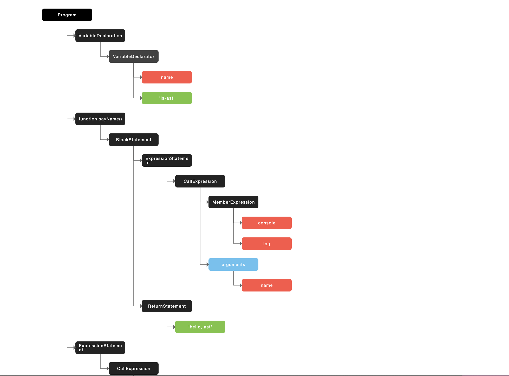

前端工具和框架更新速度非常快，不断有新技术、新工具迭代出来，对于我们前端开发者而言，只有抓住本质，了解底层，才能驾驭这些上层应用。学习 js 引擎的编译流程，能帮助我们从底层了解 js，也能对理解语言转换器 Babel、语法检查工具 ESLint、前端框架 React+Vue 等一些底层实现机制。

Chrome 浏览器是最常用的，而它的 js 引擎 V8，则是相当出名。因此，深入了解 V8 编译流程，能让我们对 js 语言以及相关工具有更充实的认知。

而要理解 V8 的工作原理，**编译器（Compiler）、解释器（Interpreter）、抽象语法树（AST）、字节码（ByteCode）、即时编译器（JIT）**这些概念， 都需要重点学习的。

## 编译器和解释器

因为机器无法直接理解和执行我们所写的代码，所以在执行程序之前，需要编译器或解释器，将我们写的代码“翻译”成机器可以理解的机器语言。根据“翻译”这个过程的执行时机，可以把语言划分为编译型语言和解释型语言。

对于编译型语言而言，在程序执行之前，程序代码都需要经过编译器的编译过程，编译之后会直接保留机器可以理解的二进制文件，这样每次运行程序时，直接运行二进制文件，不再需要重新编译了。编译型语言代表有 C、C++、GO 等。

而解释型语言编写的程序，在每次运行时都需要解释器对程序进行动态的解释和执行，比如 Python 和 js。

那么编译器和解释器是怎么“翻译”代码的呢？

编译器翻译过程：源代码经过词法分析和语法分析，转成 AST，AST 经过词义分析，转成中间代码，中间代码经过一些优化，转成二进制文件，二进制文件是可以直接执行的。如果编译过程发生了语法错误或其他错误，那么编译器就会抛出异常，生成的二进制文件也没法用。

解释器翻译过程：源代码经过词法分析和语法分析，转成 AST，AST 经过词义分析，编程字节码，字节码由解释器来执行输出程序结果。

而 V8 执行 js 代码时，既有解释器 Ignition，也有编译器 TurboFan。V8 的工作流程如下：

### 1. 生成抽象语法树（AST）和执行上下文

V8 首先通过词法分析和语法分析，将源代码转成 AST，同时创建执行上下文。这个过程重点理解抽象语法树是怎么生成的

高级语言，如 C、Java，是开发者可以理解的语言，编译器或解释器是无法理解的。对于编译器或者解释器来说，能理解的就是抽象语法树，所以无论使用的语言是编译型，还是解释型，都需要生成 AST。

js 的代码可以经过**[javascript-ast](http://resources.jointjs.com/demos/javascript-ast)**来转成 AST。

比如我们写一小段 js 代码

```js
var name = 'js-ast';
function sayName() {
  console.log(name);
  return 'hello, ast';
}
sayName();
```

经过`javascript-ast`站点转换后，是如下结构：



从图可以看出，AST 结构和代码的结构非常类似，所以也可以把 AST 看成代码的结构化的表示，编译器或者解释器后续的工作都需要依赖于 AST，而不是源代码。

AST 是非常重要的一种数据结构，在很多项目中有着广泛的应用。比如前端项目构建中，使用到的 Babel。Babel 是一个被广泛使用的代码转码器，可以将 ES6 代码转为 ES5 代码，这意味着我们可以现在就用 ES6 编写程序，而不用担心现有环境是否支持 ES6。Babel 的工作原理就是先将 ES6 源码转换为 AST，然后再将 ES6 语法的 AST 转换为 ES5 语法的 AST，最后利用 ES5 的 AST 生成 js 源代码。

除了 Babel 外，还有 ESLint 也使用 AST。ESLint 是一个用来检查 js 编写规范的插件，其检测流程也是需要将源码转换为 AST，然后再利用 AST 来检查代码规范化的问题。

那么 AST 是如何生成的呢？通常需要两个阶段：

1.  第一阶段是分词（tokenize），又称为词法分析，其作用是将一行行的源码拆解成一个个 token。所谓 token，指的是语法上不可能再分的、最小的单个字符或字符串。
2.  第二阶段是解析（parse），又称为语法分析，其作用是将上一步生成的 token 数据，根据语法规则转为 AST。如果源码符合语法规则，这一步就会顺利完成。但如果源码存在语法错误，这一步就会终止，并抛出一个“语法错误”。

这就是 AST 的生成过程，先分词，再解析。

有了 AST 后，那接下来 V8 就会生成该段代码的执行上下文。

### 2. 生成字节码

有了 AST 和执行上下文后，那接下来的第二步，解释器 Ignition 就登场了，它会根据 AST 生成字节码，并解释执行字节码。

早期的时候，V8 并没有字节码，而是直接将 AST 转换为机器码，由于执行机器码的效率是非常高效的，所以这种方式在发布后的一段时间内运行效果是非常好的。但是随着 Chrome 在手机上的广泛普及，特别是运行在 512M 内存的手机上，内存占用问题也暴露出来了，因为 V8 需要消耗大量的内存来存放转换后的机器码。为了解决内存占用问题，V8 团队大幅重构了引擎架构，引入字节码，并且抛弃了之前的编译器，最终花了将进四年的时间，实现了现在的这套架构。

那什么是字节码呢？为什么引入字节码就能解决内存占用问题呢？

字节码就是介于 AST 和机器码之间的一种代码。但是与特定类型的机器码无关，字节码需要通过解释器将其转换为机器码后才能执行。

机器码所占用的空间内存远比字节码庞大，所以使用字节码可以节省内存。

### 3. 执行代码

生成字节码之后，接下来就要进入执行阶段了。

通常，如果有一段第一次执行的字节码，解释器 Ignition 会逐条解释执行。解释器 Ignition 除了负责生成字节码之外，它还有另外一个作用，就是解释执行字节码。在 Ignition 执行字节码的过程中，如果发现有热点代码（HotSpot），比如一段代码被重复执行多次，这种就称为热点代码，那么后台的编译器 TurboFan 就会把该段热点的字节码编译为高效的机器码，然后当再次执行这段被优化的代码时，只需要执行编译后的机器码就可以了，这样就大大提升了代码的执行效率。

V8 的解释器和编译器的取名也很有意思。解释器 Ignition 是点火器的意思，编译器 TurboFan 是涡轮增压的意思，寓意着代码启动时通过点火器慢慢发动，一旦启动，涡轮增压介入，其执行效率随着执行时间越来越高效率，因为热点代码都被编译器 TurboFan 转换了机器码，直接执行机器码就省去了字节码“翻译”为机器码的过程。

其实字节码配合解释器和编译器是最近一段时间很火的技术，比如 Java 和 Python 的虚拟机也都是基于这种技术实现的，我们把这种技术称为即时编译（JIT）。具体到 V8，就是指解释器 Ignition 在解释执行字节码的同时，收集代码信息，当它发现某一部分代码变热了之后，TurboFan 编译器便闪亮登场，把热点的字节码转换为机器码，并把转换后的机器码保存起来，以备下次使用。

对于 js 工作引擎，除了 V8 使用了“字节码 +JIT”技术之外，苹果的 SquirrelFish Extreme 和 Mozilla 的 SpiderMonkey 也都使用了该技术。

## 如何根据编译流程做 js 性能优化

我们已经了解 V8 是如何执行一段 js 代码的了。在过去几年中，js 的性能得到了大幅提升，这得益于 V8 团队对解释器和编译器的不断改进和优化。

虽然在 V8 诞生之初，也出现过一系列针对 V8 而专门优化 js 性能的方案，比如隐藏类、内联缓存等概念都是那时候提出来的。不过随着 V8 的架构调整，你越来越不需要这些微优化策略了，相反，对于优化 js 执行效率，你应该将优化的中心聚焦在单次脚本的执行时间和脚本的网络下载上，主要关注以下三点内容：

1. 提升单次脚本的执行速度，避免 js 的长任务霸占主线程，这样可以使得页面快速响应交互；
2. 避免大的内联脚本，因为在解析 HTML 的过程中，解析和编译也会占用主线程；
3. 减少 js 文件的容量，因为更小的文件会提升下载速度，并且占用更低的内存。

## 小结

先是了解了编译器和解释器的区别。接着分析了 V8 是如何执行一段 js 代码的：V8 依据 js 代码生成 AST 和执行上下文，再基于 AST 生成字节码，然后通过解释器执行字节码，通过编译器来优化编译字节码。基于字节码和编译器，我们又介绍了 JIT 技术。最后延伸说明了下优化 js 性能的一些策略。
