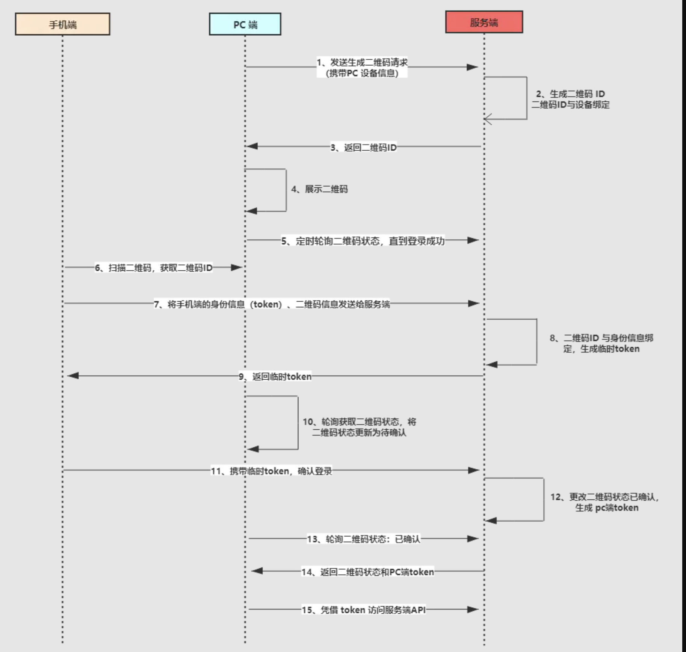

由于 HTTP 协议本身是无状态的，所以客户端同服务端通信时，服务端并不知道每次通信时，与之通信的是哪个客户端，再加上服务器资源并不是向所有用户开放的，而是仅对部分用户登陆，在这种情况下，实现用户的鉴权登陆是一种必要需求。

开发中常用到用户鉴权登陆方式，一般有四种：

1. HTTP Basic Authentication
2. session-cookie
3. Token
4. OAuth

## HTTP Basic Authentication

这种方式会在客户端弹出一个登陆窗口，要求用户输入密码和密码进行登陆。但是这种方式使用 Base64 加密用户名和密码，所以安全性很低，已经不怎么使用了

## session-cookie

这种方式依赖 cookie 来使用。首次登陆时，用户输入用户名和密码，点击登陆，通过 post 请求将用户名和密码传给服务器，服务器验证身份后，会生成一个 sessions 的对象，然后根据用户名和密码生成一个加密过的 sessionId，将这个 sessionId 存入先前的 sessions 对象了，接着再把 sessionId 通过名为`set-cookie`的 HTTP Header，返回给客户端。之后客户端的每次请求，请求头都会带上这个 sessionId，服务器只需要去 sessions 里比对 sessionId，就知道是哪个用户了。

## Token

Token 是令牌的意思。以 Token 做用户标识，是在原生应用（App）兴起后。因为原生应用并没有浏览器环境，所以并没有 cookie，所以服务端在校验完客户端身份后，会直接生成一个 token 凭证，并且返回给客户端，让客户端自己保存。客户端每次请求服务器的时候，必须带上 token，服务器根据 token 来验证用户身份。最常用的 Token 令牌，就是 JWT，也就是 JSON Web Token。具体来说，Token 的验证，在服务器和客户端共发生了 6 次交互，过程如下：

1. 客户端使用用户名跟密码请求登陆
2. 服务器收到请求，验证用户名和密码
3. 验证成功后，服务器签发 Token
4. 客户端接受 Token，并自己存储
5. 客户端再次请求服务器的时候，带上 Token
6. 服务器验证 Token，识别用户身份

JWT 则是使用较为广泛的一种 Token 方式。JWT 的信息主要有 3 部分：

1. headers： 描述 token 类别和加密算法
2. claims：用户的一些信息，开发者自定义的字段
3. signature：根据 headers 中指定的算法和私钥，在服务器进行加密而得到签名

## OAuth

第三方平台授权登陆。常见于 Github 授权登陆 QQ、Google 授权登陆、微信授权登陆等。以 QQ 授权登陆，流程如下

1. 客户端访问 QQ 鉴权服务器某个 url，向 QQ 鉴权服务器请求一个 code，这个 code 一般在页面回调后填入到了页面的 url
2. 使用 code，加上开发者的信息（AppID，AppSecret），向 QQ 鉴权服务器请求一个 access_token
3. 使用 access_token，去访问鉴权服务器的某些接口，获取用户的一些关键信息，如昵称、性别。

## 单点登陆（Single Sign On）

相比于上面的单系统登录，sso 需要一个独立的认证中心，只有认证中心能接受用户的用户名密码等安全信息，其他系统不提供登录入口，只接受认证中心的间接授权。间接授权通过令牌实现，sso 认证中心验证用户的用户名密码没问题，创建授权令牌，在接下来的跳转过程中，授权令牌作为参数发送给各个子系统，子系统拿到令牌，即得到了授权，可以借此创建局部会话，局部会话登录方式与单系统的登录方式相同。这个过程，也就是单点登录的原理。

## 扫码登陆

现在扫码登陆特别流行，比如知乎、哔哩哔哩等 pc 端，都提供了扫码登陆的入口。那么扫码登陆是怎样做的呢？具体流程参考这张图：

扫码登陆可分为三个阶段：待扫描（pc 端生成二维码）、已扫描确认（App 端扫描确认）、已确认（pc 端已确认登陆）。

### 待扫描

待扫描阶段也就是流程图中 1~5 阶段，即生成二维码阶段，这个阶段跟移动端没有关系，是 PC 端跟服务端的交互过程

首先 PC 端携带设备信息想服务端发起生成二维码请求，服务端会生成唯一的二维码 ID，你可以理解为 UUID，并且将 二维码 ID 跟 PC 设备信息关联起来，这跟移动端登录有点相似。
PC 端接受到二维码 ID 之后，将二维码 ID 以二维码的形式展示，等待移动端扫码。此时在 PC 端会启动一个定时器，轮询查询二维码的状态。如果移动端一直未扫描的话，那么一段时间后二维码将会失效。

## 已扫描确认阶段

流程图中第 6 ~ 10 阶段，手机扫 pc 端的二维码后，PC 端的二维码会变成已扫码，请在手机端确认。这个阶段是移动端跟服务端交互的过程。

首先移动端扫描二维码，获取二维码 ID，然后将手机端登录的信息凭证（token）和 二维码 ID 作为参数发送给服务端，此时的手机一定是登录的，不存在没登录的情况。

服务端接受请求后，会将 token 与二维码 ID 关联，为什么需要关联呢？你想想，我们使用微信时，移动端退出，PC 端是不是也需要退出，这个关联就是很有必要的。然后会生成一个一次性 token，这个 token 会返回给移动端，一次性 token 用作确认时候的凭证。

此时，PC 端的定时器，会轮询到二维码的状态已经发生变化，会将 PC 端的二维码更新为已扫描，请确认。

## 已确认

流程图中的 第 11 ~ 15 步骤，这是扫码登录的最后阶段，移动端携带上一步骤中获取的临时 token ，确认登录，服务端校对完成后，会更新二维码状态，并且给 PC 端生成一个正式的 token ，后续 PC 端就是持有这个 token 访问服务端。

PC 端的定时器，轮询到了二维码状态为登录状态，并且会获取到了生成的 token ，完成登录，后续访问都基于 token 完成。

在服务器端会跟手机端一样，维护着 token 跟二维码、PC 设备信息、账号等信息。
到此，二维码扫描登录原理就差不多了，二维码扫描登录在原理上不难理解，跟 OAuth2.0 有一丝的相似之处，但是实现起来可能就比较复杂。

## 小结

这一篇主要总结了 WEB 鉴权的常用方式，顺便学了下 SSO 和扫码登陆的相关知识点，对项目里做鉴权登陆提供了不少理论基础。
