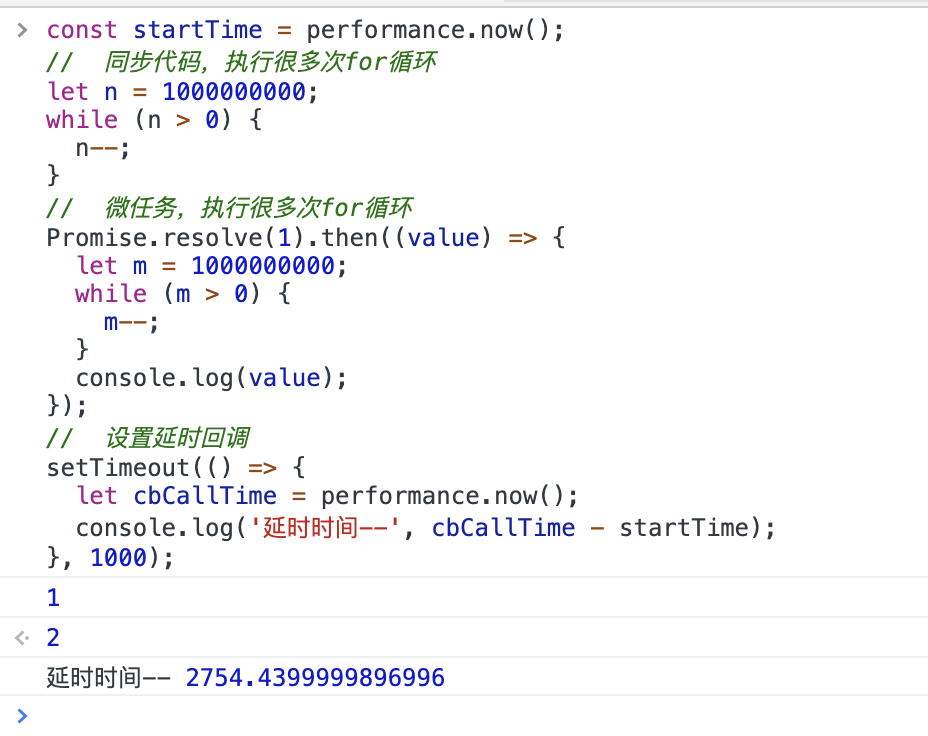

从事前端开发，对于`setTimeout(cb, delayTime)`这个 API 一定不陌生，它代表了一个定时器，用来指定函数`cb`在多少秒后被调用。它的返回值是一个整数，表示定时器的编号，我们可以用这个编号，来取消这个定时器。

## 浏览器怎么实现 setTimeout

定时器的工作原理，和浏览器的消息队列机制有关。浏览器渲染进程中所有运行在主线程上的任务都需要先添加到消息队列，然后事件循环系统再按照顺序执行消息队列中的任务。来看看浏览器中典型的事件：

- 当接收到 HTML 文档数据，渲染引擎就会将“解析 DOM”事件添加到消息队列中
- 当用户改变了 Web 页面的窗口大小，渲染引擎就会将“重新布局”的事件添加到消息队列中。
- 当触发了 JavaScript 引擎垃圾回收机制，渲染引擎会将“垃圾回收”任务添加到消息队列中。
- 同样，如果要执行一端异步的代码，也需要将执行任务放入到消息队列中

通过定时器设置回调函数有点特别，它们需要在指定的时间间隔内被调用，但消息队列中的任务是按照顺序执行的，所以为了保证回调函数能在指定时间内执行，你不能将定时器的回调函数直接添加到消息队列中。

浏览器中，除了一个消息队列，其实还有一个延迟队列，专门用来处理延迟执行的任务列表。当通过 JavaScript 创建一个定时器时，渲染进程会将该定时器的回调任务添加到延迟队列中。

当 js 调用`setTimeout`设置回调函数时，渲染进程会创造一个回调任务，回调任务包含了回调函数、发起时间、延迟执行时间等信息，这个回调任务会被添加到延迟队列中。

浏览器的事件循环系统，在一轮事件循环中，先处理完同步代码，再处理完任务队列的任务后，就会来到延迟队列，会根据延迟队列中各延迟任务的发起时间和延迟时间，计算出到期的任务，然后依次执行这些到期任务，等到期任务执行后，开始下一个循环过程。

设置一个定时器，JavaScript 引擎会返回一个定时器的 ID。那通常情况下，当一个定时器的任务还没有被执行的时候，也是可以取消的，具体方法是调用 clearTimeout 函数。浏览器内部实现，就是根据 id，找到延迟队列中的对应的任务，从延迟队列删掉。

##  使用 setTimeout 注意的点

setTimeout 设置的延时回调，并不是总会在设定的时间后执行，假如同步代码会，还有微任务代码，执行时间太长的话，就会影响到延时回调的执行时间，比如这样一段代码

```js
const startTime = performance.now();
//  同步代码，执行很多次for循环
let n = 100000000;
while (n > 0) {
  n--;
}
//  微任务，执行很多次for循环
Promise.resolve(1).then((value) => {
  let m = 1000000000;
  while (m > 0) {
    m--;
  }
  console.log(value);
});
//  设置延时回调
setTimeout(() => {
  let cbCallTime = performance.now();
  console.log('延时时间--', cbCallTime - startTime);
}, 1000);
```

在浏览器跑一下，可以看到定时器回调执行的时间，和设置的延迟时间，明显不一样了



如果 setTimeout 存在嵌套调用，那么系统会设置最短时间间隔为 4 毫秒。所以，一些实时性较高的需求就不太适合使用 setTimeout 了，比如你用 setTimeout 来实现 JavaScript 动画就不是一个很好的主意。

未激活的页面，setTimeout 执行最小间隔是 1000 毫秒。

除了要了解定时器的回调函数时间比实际设定值要延后之外，还有一点需要注意下，那就是 Chrome、Safari、Firefox 都是以 32 个 bit 来存储延时值的，32bit 最大只能存放的数字是 2147483647 毫秒，这就意味着，如果 setTimeout 设置的延迟值大于 2147483647 毫秒（大约 24.8 天）时就会溢出，那么相当于延时值被设置为 0 了，这导致定时器会被立即执行。比如下面这个定时器，会立即执行

```js
setTimeout(() => {
  console.log('会立即执行');
}, 25 * 24 * 60 * 60 * 1000);
```

## 小结

为了支持定时器的实现，浏览器增加了延时队列。由于消息队列排队和一些系统级别的限制，通过 setTimeout 设置的回调任务并非总是可以实时地被执行，这样就不能满足一些实时性要求较高的需求了。
