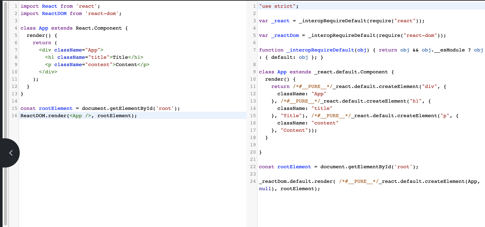

在日常的 React 开发工作中，我们已经习惯了使用 JSX 来描述 React 的组件内容。关于 JSX 语法本身，相信每位 React 开发者都不陌生。来看下面一个简单的组件

```jsx
import React from 'react';
import ReactDOM from 'react-dom';

class App extends React.Component {
  render() {
    return (
      <div className="App">
        <h1 className="title">Title</h1>
        <p className="content">Content</p>
      </div>
    );
  }
}

const rootElement = document.getElementById('root');
ReactDOM.render(<App />, rootElement);
```

看到这段 JSX 代码，是不是会有些疑问：

1. JSX 的本质是什么，它和 JS 之间到底是什么关系？
2. 为什么要用 JSX？不用会有什么后果？
3. JSX 背后的功能模块是什么，这个功能模块都做了哪些事情？

接下来，这些疑问一个一个来解答

## JXS 的本质：JavaScript 的语法扩展

JSX 到底是什么，React 官网给出了一段定义：

> JSX 是 JavaScript 的一种语法扩展，它和模板语言很接近，但是它充分具备 JavaScript 的能力。

这里提到，JSX 在被编译后，会变成一个针对 React.createElement 的调用，而“编译”这个动作，是由 Babel 来完成的。

那什么又是 Babel？同样看看 Babel 官网的定义

> Babel 是一个工具链，主要用于将 ECMAScript 2015+ 版本的代码转换为向后兼容的 JavaScript 语法，以便能够运行在当前和旧版本的浏览器或其他环境中。

意思 Babel 是个转换器，可以将高版本的语法，根据当前 js 宿主环境，将代码编译成当前 js 宿主环境可支持的语法。类似的，**Babel 也具备将 JSX 语法转换为 JavaScript 代码的能力。**毕竟 JSX 作为 js 语法的拓展，也可以理解成一种高级语法。

那么 Babel 具体会将 JSX 处理成什么样子呢？我们不如直接打开 Babel 的 playground 来看一看，这里将开头那段 jsx 代码直接填入，会看到这样的转换：



可以看到，所有的 JSX 标签都被转化成了 React.createElement 调用，这也就意味着，我们写的 JSX 其实写的就是 React.createElement，虽然它看起来有点像 HTML，但也只是“看起来像”而已。JSX 的本质是 React.createElement 这个 JavaScript 调用的语法糖，这也就完美地呼应上了 React 官方给出的“JSX 充分具备 JavaScript 的能力”这句话。

## 为什么要用 JSX

既然 JSX 等价于一次 React.createElement 调用，那么 React 官方为什么不直接引导我们用 React.createElement 来创建元素呢？

原因其实很简单，看之前 Babel 转换那张图，左边是 jsx 代码，右边是编译后的代码是真实的 js，在功能相同的情况下，jsx 代码层次分明、结构清晰，而真实的 js 则让人混乱杂糅，不仅难书写，也难阅读。

JSX 语法糖允许前端开发者使用我们最为熟悉的类 HTML 标签语法来创建虚拟 DOM，在降低学习成本的同时，也提升了研发效率与研发体验。

## JSX 怎么映射为 DOM

jsx 代码编译后，转成了对`React.createElement`的调用，而`React.createElement`的源码是这样的

```js
/**
 101. React的创建元素方法
 */
export function createElement(type, config, children) {
  // propName 变量用于储存后面需要用到的元素属性
  let propName;
  // props 变量用于储存元素属性的键值对集合
  const props = {};
  // key、ref、self、source 均为 React 元素的属性，此处不必深究
  let key = null;
  let ref = null;
  let self = null;
  let source = null;
  // config 对象中存储的是元素的属性
  if (config != null) {
    // 进来之后做的第一件事，是依次对 ref、key、self 和 source 属性赋值
    if (hasValidRef(config)) {
      ref = config.ref;
    }
    // 此处将 key 值字符串化
    if (hasValidKey(config)) {
      key = '' + config.key;
    }
    self = config.__self === undefined ? null : config.__self;
    source = config.__source === undefined ? null : config.__source;
    // 接着就是要把 config 里面的属性都一个一个挪到 props 这个之前声明好的对象里面
    for (propName in config) {
      if (
        // 筛选出可以提进 props 对象里的属性
        hasOwnProperty.call(config, propName) &&
        !RESERVED_PROPS.hasOwnProperty(propName)
      ) {
        props[propName] = config[propName];
      }
    }
  }

  // childrenLength 指的是当前元素的子元素的个数，减去的 2 是 type 和 config 两个参数占用的长度
  const childrenLength = arguments.length - 2;
  // 如果抛去type和config，就只剩下一个参数，一般意味着文本节点出现了
  if (childrenLength === 1) {
    // 直接把这个参数的值赋给props.children
    props.children = children;
    // 处理嵌套多个子元素的情况
  } else if (childrenLength > 1) {
    // 声明一个子元素数组
    const childArray = Array(childrenLength);
    // 把子元素推进数组里
    for (let i = 0; i < childrenLength; i++) {
      childArray[i] = arguments[i + 2];
    }
    // 最后把这个数组赋值给props.children
    props.children = childArray;
  }

  // 处理 defaultProps
  if (type && type.defaultProps) {
    const defaultProps = type.defaultProps;
    for (propName in defaultProps) {
      if (props[propName] === undefined) {
        props[propName] = defaultProps[propName];
      }
    }
  }

  // 最后返回一个调用ReactElement执行方法，并传入刚才处理过的参数

  return ReactElement(
    type,
    key,
    ref,
    self,
    source,
    ReactCurrentOwner.current,
    props
  );
}
```

先看入参，也就是生成一个元素需要哪些信息，`export function createElement(type, config, children)`

- type：用于标识节点的类型。它可以是类似“h1”“div”这样的标准 HTML 标签字符串，也可以是 React 组件类型或 React fragment 类型。
- config：以对象形式传入，组件所有的属性都会以键值对的形式存储在 config 对象中。
- children：以对象形式传入，它记录的是组件标签之间嵌套的内容，也就是所谓的“子节点”“子元素”。

如果文字比较抽象，那写一个简单例子来理解

```js
React.createElement(
  'ul',
  {
    // 传入属性键值对
    className: 'list'
    // 从第三个入参开始往后，传入的参数都是 children
  },
  React.createElement(
    'li',
    {
      key: '1'
    },
    '1'
  ),
  React.createElement(
    'li',
    {
      key: '2'
    },
    '2'
  )
);
```

这个调用会生成如下 DOM 结构

```html
<ul className="list">
  <li key="1">1</li>
  <li key="2">2</li>
</ul>
```

`createElement`在逻辑上的流程，是下面这些：

1. `React.createElement(type, config, children)`开始
2. 二次处理 key ref self source
3. 遍历 config 筛选出可以提进 props 的属性
4. 提取子元素，推入 childArray
5. 格式化 defaultProps
6. 综合以上数据作为入参，发起 ReactElement 的调用

所以 `createElement`并没有涉及算法或者真实 dom 的逻辑，每一个步骤几乎都只是在格式化数据

说得更直白点，createElement 就像是开发者和 ReactElement 调用之间的一个“转换器”、一个数据处理层。可以从开发者处接受相对简单的参数，然后将这些参数按照 ReactElement 的预期做一层格式化，最终通过调用 ReactElement 来实现元素的创建。

而 ReactElement 对象实例，本质上是以 JavaScript 对象形式存在的对 DOM 的描述，也就是老生常谈的“虚拟 DOM”。既然是“虚拟 DOM”，那就意味着和渲染到页面上的真实 DOM 之间还有一些距离，这个“距离”，就是`ReactDOM.render`方法来填补的。

于是乎，在每一个 React 项目的入口文件中，都少不了对 React.render 函数的调用。ReactDOM.render 方法可以接收 3 个参数，其中第二个参数就是一个真实的 DOM 节点，这个真实的 DOM 节点充当“容器”的角色，React 元素最终会被渲染到这个“容器”里面去。

```js
ReactDOM.render(
  //  需要渲染的元素 ReactElement
  <App />,
  //  元素挂载的目标容器，真实dom元素
  document.getElementById('#root'),
  //  回调函数
  [callback]
);
```
