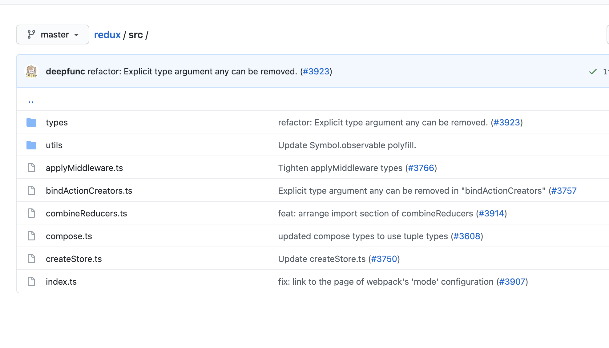

Redux 作为 React 的状态管理器，其知名程度，甚至让不少初学者，以为 Redux 跟 React 是深度绑定。实际上，Redux 提供了只能可预测、可追溯的状态管理功能，它代表的是一种状态管理的思想，在 React 能用，在 Vue 也能用。

## Flux

Redux 的设计，在很大程度上受益于 Flux 架构，所以在某种程度上，可以 Redux 是 Flux 的一种实现，虽然 Redux 并没有完全遵守 Flux 的设定。而理解 Flux 可以帮我们从抽象层次上掌握 Redux。

Flux 本身而言，并不是一个具体的框架，而是一套由 Facebook 提出的应用架构，这套架构约束的是**应用处理数据的模式**。在 Flux 架构中，一个应用被拆分为以下四个部分：

- View（视图层）：用户界面。该用户界面可以是以任何形式实现出来的，React 组件是一种形式，Vue、Angular 也完全 OK。Flux 架构与 React 之间并不存在耦合关系。
- Action（动作）：可以理解为视图层发出的“消息”，它会触发应用状态的改变。
- Dispatcher（派发器）：它负责对 action 进行分发。
- Store（数据层）：它是存储应用状态的“仓库”，此外还会定义修改状态的逻辑。store 的变化最终会映射到 view 层上去。

一个典型的 Flux 工作流是这样的：用户与 View 之间产生交互，通过 View 发起一个 Action；Dispatcher 会把这个 Action 派发给 Store，通知 Store 进行相应的状态更新。Store 状态更新完成后，会进一步通知 View 去更新界面。

Flux 架构最核心的特征就是：单向数据流。而单向数据流，是为了解决什么问题呢？

单向数据流是为了解决前端 MVC 模式下，双向数据流在某些场景带来的困扰。前端的 MVC 架构，除了允许用户通过 View 层交互来触发流程以外还允许用户通过直接触发 Controller 逻辑来触发流程。

在 MVC 应用中，会涉及三个部分：

1. Model（模型），程序需要操作的数据或信息；
2. View（视图），用户界面；
3. Controller（控制器），用于连接 View 和 Model，管理 Model 与 View 之间的逻辑。

原则上来说，三者的关系应该像上图一样，用户操作 View 后，由 Controller 来处理逻辑（或者直接触发 Controller 的逻辑），经过 Controller 将改变应用到 Model 中，最终再反馈到 View 上。在这个过程中，数据流应该是单向的

事实上，在许多服务端的 MVC 应用中，数据流确实能够保持单向。但是在前端场景下，实际的 MVC 应用要复杂不少，前端应用/框架往往出于交互的需要，允许 View 和 Model 直接通信。这就允许了双向数据流的存在。当业务复杂度较高时，数据流会变得非常混乱。混乱的数据下，我们无法区分数据的变动到底是由哪些 Controller 引起的。

这个时候，再看看 Flux 的核心--单向数据流，保证了状态变化是可预测的。如果 store 中的数据发生了变化，那么有且仅有一个原因，那就是由 Dispatcher 派发 Action 来触发的。这样一来，就从根本上避免了混乱的数据关系，使整个流程变得清晰简单。

不过这并不意味着 Flux 是完美的。事实上，Flux 对数据流的约束背后是不可忽视的成本：除了开发者的学习成本会提升外，Flux 架构还意味着项目中代码量的增加。

Flux 架构往往在复杂的项目中才会体现出它的优势和必要性。如果项目中的数据关系并不复杂，其实完全轮不到 Flux 登场，这一点对于 Redux 来说也是一样的。

从单向数据流的角度出发，再品味一下 Redux 官方对 Redux 的定义

> Redux 是 JavaScript 状态容器，它提供可预测的状态管理。

## Redux 的关键要素和工作流

Redux 主要由三部分组成

1. Store：它是一个单一的数据源，而且是只读的；
2. Action: 对状态变化的“描述”
3. Reducer：一个纯函数，负责对接收到 action 进行分发和处理，计算得到最新的 state 并返回给 Store

Store、Action 和 Reducer 三者紧密配合，便形成了 Redux 独树一帜的工作流。在 Redux 的整个工作过程中，数据流是严格单向的。如果我们想对数据进行修改，只有一种途径：派发 Action。Action 会被 Reducer 读取，Reducer 将根据 Action 内容的不同执行不同的计算逻辑，最终生成新的 state（状态），这个新的 state 会更新到 Store 对象里，进而驱动视图层面作出对应的改变。

对于组件来说，任何组件都可以以约定的方式从 Store 读取到全局的状态，任何组件也都可以通过合理地派发 Action 来修改全局的状态。Redux 通过提供一个统一的状态容器，使得数据能够自由而有序地在任意组件之间穿梭。

## Redux 如何工作

查阅 Redux 的 Github 仓库，能看到如下的源码结构：



简单介绍下：utils 是工具方法库；index.js 作为入口文件，用于对功能模块进行收敛和导出。真正工作的是功能模块本身，也就是下面这几个文件：

- applyMiddleware.js
- bindActionCreators.js
- combineReducers.js
- compose.js
- createStore.js

applyMiddleware 是中间件模块，bindActionCreators（用于将传入的 actionCreator 与 dispatch 方法相结合，揉成一个新的方法），combineReducers（用于将多个  reducer 合并起来）、compose（用于把接收到的函数从右向左进行组合）。

这前面几个 API，属于辅助性 API，不用也不妨碍 Redux 工作。

而 createStore 方法是我们在使用 Redux 时最先调用的方法，它是整个流程的入口，也是 Redux 中最核心的 API。

createStore 是这么用的：

```js
import { createStore } from 'redux';
const store = createStore(
  reducer,
  initial_state,
  applyMiddleware(middleware1, middleware2 /* more middleware*/)
);
```

调用`createStore`生成 store，这个函数内部发生了什么呢？

```js
function createStore(reducer, preloadedState, enhancer) {
  //  这里处理的没有初定初始状态，也就是第一个参数和第二个参数都是function
  if (typeof preloadedState === 'function' && enhancer === 'undefined') {
    //  此时第二个参数会被当作 enhancer 中间件
    enhancer = preloadedState;
    preloadedState = unescape;
  }
  //  当enhancer不为空，会将原来的createStore作为参数传到enhancer
  if (typeof enhancer !== 'undefined') {
    return enhancer(createStore)(reducer, preloadedState);
  }
  //  记录当前的reducer，因为 replaceReducer 会修改 reducer的内容
  let currentReducer = reducer;
  //  记录当前state
  let currentState = preloadedState;
  //  声明 listeners 数组，这个数组用于记录 在 subscribe 中订阅的事件
  let currentListeners = [];
  //  nextListeners是currentListeners
  let nextListeners = currentListeners;
  //  该变量用于记录是否正在进行dispatch
  let isDispatching = false;
  //  该方法用于确定快照nextListeners是 currentListener 的副本，而不是currentListeners本身
  function ensureCanMutateNextListeners() {
    if (nextListeners === currentListeners) {
      nextListeners = currentListeners.slice();
    }
  }
  //  通过 getState获取当前状态
  function getState() {
    return currentState;
  }
  //  subscribe订阅方法，它将会定义 dispatch 最后执行的 listeners 数组的内容
  function subscribe(listener) {
    if (typeof listener !== 'function') {
      throw new Error('Expected the listeners to be a function');
    }
    if (isDispatching) {
      throw new Error(
        'You may not call store.subscribe() while the reducer is executing'
      );
    }
    //  该变量用于防止多次调用subscribe
    let isSubscribe = true;
    //  确保nextListeners和currentListeners不是同一个
    ensureCanMutateNextListeners();
    //  注册监听函数
    nextListeners.push(listener);
    //  返回取消订阅当前listeners的方法
    return function unsubscribe() {
      if (!isSubscribe) {
        return;
      }
      isSubscribe = false;
      ensureCanMutateNextListeners();
      const index = nextListeners.indexOf(listener);
      //  将当前的listener从nextListeners删除
      nextListeners.splice(index, 1);
    };
  }
  //  定义dispatch方法，用于派发action
  function dispatch(action) {
    //  校验 action 数据是否合法
    if (!isPlainObject(action)) {
      throw new Error('not plain object，需要中间件处理');
    }
    if (typeof action.type === 'undefined') {
      throw new Error('action必须又type');
    }
    //  若处于dispatch流程中，不允许再发起
    if (isDispatching) {
      throw new Error('已在dispatch流程中');
    }
    try {
      isDispatching = true;
      // 调用reducer，计算新的state
      currentState = currentReducer(currentState, action);
    } finally {
      //  执行结束后，把"锁"打开，允许再次进行 dispatch
      isDispatching = false;
    }
    //  触发订阅
    const listeners = (currentListeners = nextListeners);
    listeners.forEach((listeners) => listeners());
    return action;
  }
  //  replaceReducer可更换当前的reducer
  function replaceReducer(nextReducer) {
    currentReducer = nextReducer;
    dispatch({ type: 'REPLACE_REDUCER' });
    return store;
  }
  //  observable方法
  function observable() {}
  //  初始化它的初始值
  dispatch({ type: 'INIT' });
  return {
    dispatch,
    subscribe,
    getState,
    replaceReducer
  };
}
```

通过阅读`createStore`的源代码，可以知道，`createStore`内部做了太多事情，它的逻辑流程大概是这样的：

1. 调用`createStore`
2. 处理没有传入的初始状态（也就是前两个入参都是 function 的情况）
3. 若 enhancer 不为空，则用 enhancer 包装 createStore
4. 定义内部变量
5. 定义`ensureCanMutateNextListeners`
6. 定义`getState`方法，该方法用于获取当前状态
7. 定义`subscribe`方法，该方法用于注册`listeners`（订阅监听函数）
8. 定义`dispatch`方法，用于派发`action`，调用`reducer`并触发订阅
9. 定义`replaceReducer`方法，该方法用于替换 reducer
10. 执行一次`dispatch`，完成状态的初始化
11. 定义 observable 方法（可不写）
12. 将步骤 6-11 中定义的方法放进 store 对象返回

而在`createStore`返回的对象中，`getState`、`subscribe`、`dispatch`是我们最常用的。

而`dispatch`是 Redux 是工作流的核心，是因为`dispatch`这个动作能把 action、reducer 和 store 给这三位主角串联起来了。`dispatch`的内部逻辑，足以反映了这三者之间打配合的过程。

### dispatch

再来看看`dispatch`的逻辑

```js
function dispatch(action) {
  if (!isPlainObject(action)) {
    throw new Error('得是纯对象，或者使用中间件，就可以用函数型action了');
  }
  if (typeof action.type === 'undefined') {
    throw new Error('action必须有type属性');
  }
  //  若处于dispatching流程中，则不允许在派发action
  if (isDispatching) {
    throw new Error('Reducer may not dispatch actions');
  }
  try {
    //  执行reducer 前，先上锁，标记当前处于dispatching流程
    isDispatching = true;
    //  调用reducer，生成新的state
    currentState = currentReducer(currentState, action);
  } finally {
    //  执行结束，把'锁'打开，允许再次进行dispatch
    isDispatching = false;
  }
  //  触发订阅函数
  const listeners = (currentListeners = nextListeners);
  listeners.forEach((listener) => listener());
  return action;
}
```

dispatch 工作流中最关键的就是执行 reducer 这一步，通过“上锁”模式，避免套娃、重复派发 action。

reducer 的本质是 store 的更新规则，它指定了应用状态的变化如何响应 action 并发送到 store。

在调用 reducer 之前，Redux 首先会将 isDispatching 变量置为 true，待 reducer 执行完毕后，再将 isDispatching 变量置为 false。这种模式，在`setState`批量处理时，也用到过。

所以要用 isDispatching 将 dispatch 的过程锁起来，目的是规避“套娃式”的 dispatch。更准确地说，是为了避免开发者在 reducer 中手动调用 dispatch。

“上锁”是为了干嘛呢？从设计的角度来看，作为一个“计算 state 专用函数”，Redux 在设计 reducer 时就强调了它必须是“纯净”的，它不应该执行除了计算之外的任何“脏操作”，dispatch 调用显然是一个“脏操作”；其次，从执行的角度来看，若真的在 reducer 中调用 dispatch，那么 dispatch 又会反过来调用 reducer，reducer 又会再次调用 dispatch......这样反复相互调用下去，就会进入死循环，属于非常严重的误操作。

因此，在 dispatch 的前置校验逻辑中，一旦识别出 isDispatching 为 true，就会直接 throw Error，把死循环扼杀在摇篮里：

```js
if (isDispatching) {
  throw new Error('Reducers may not dispatch actions.');
}
```

### 触发订阅

在 reducer 执行完毕后，会进入触发订阅的过程，它对应的是下面这段代码：

```js
//  触发订阅函数
const listeners = (currentListeners = nextListeners);
listeners.forEach((listener) => listener());
```

Redux 其实也是用的“订阅-发布模式”。dispatch 中执行的 listeners 数组从订阅中来，而执行订阅需要主动调用 subscribe。在实际的开发中，subscribe 并不是一个严格必要的方法，只有在需要监听状态的变化时，我们才会调用 subscribe。

subscribe 接收一个 Function 类型的 listener 作为入参，它的返回内容恰恰就是这个 listener 对应的解绑函数。下面这段示例代码简单介绍 subscribe 的使用姿势：

```js
function handleStateChange() {
  //  回调函数逻辑
}
const unsubscribe = store.subscribe(handleStateChange);
unsubscribe();
```

subscribe 在订阅时只需要传入监听函数，而不需要传入事件类型。这是因为 Redux 中已经默认了订阅的对象就是“状态的变化（准确地说是 dispatch 函数的调用）”这个事件。

subscribe 是如何与 Redux 主流程结合的呢？首先，我们可以在 store 对象创建成功后，通过调用 store.subscribe 来注册监听函数，也可以通过调用 subscribe 的返回函数来解绑监听函数，监听函数是用 listeners 数组来维护的；当 dispatch action 发生时，Redux 会在 reducer 执行完毕后，将 listeners 数组中的监听函数逐个执行。这就是 subscribe 与 Redux 主流程之间的关系。

不过让很让人在意的点，就是源码中`currentListeners`和`nextListeners`这两个 listeners，还有`ensureCanMutateNextListeners`的调用，为什么要用两个 listeners 数组呢？

要理解这个问题，就要理解 Redux 中订阅过程（也就是`store.subscribe()`）和发布过程(也就是`store.dispatch(action)`)各自是如何处理 listeners 数组的

### 订阅过程的 listeners 数组

两个 listeners 第一次交锋发生在 createStore 的变量初始阶段，也就是下面这段代码

```js
let nextListeners = currentListeners;
```

这个时候，两者确实指向同一个对象。但是当 subscribe 第一次被调用的时候，`ensureCanMutateNextListeners`就会发现这一点，然后将`currentListeners`的浅拷贝赋值给`nextListeners`，这样两个 listeners 内容相同，但是引用不同了，是两个对象了。

在 subscribe 的逻辑中，`ensureCanMutateNextListeners`每次都会在 listener 被注册前调用，用以确保`nextListeners`和`currentListeners`是不同的两个引用。在`ensureCanMutateNextListeners`被调用后，再注册 listener，源码是这样的

```js
nextListeners.push(listener);
```

### 发布过程的 listeners 数组

触发订阅这个过程，是`dispatch(action)`引起的

```js
//  触发订阅
const listeners = (currentListeners = nextListeners);
for (let i = 0; i < listeners.length; i++) {
  const listener = listeners[i];
  listener();
}
```

在触发订阅的过程中，currentListeners 会被赋值为 nextListeners，而实际被执行的 listeners 数组又会被赋值为 currentListeners。因此，最终被执行的 listeners 数组，实际上和当前的 nextListeners 指向同一个引用。

那么问题来了，注册监听也是操作 nextListeners，触发订阅也是读取 nextListeners（实际上，细心的同学会注意到，取消监听操作的也是 nextListeners 数组）。既然如此，要 currentListeners 有何用？

### currentListeners 数组用于确保监听函数执行过程中的稳定性

正因为任何变更都是在 nextListeners 上发生的，我们才需要一个不会被变更的、内容稳定的 currentListeners ，来确保监听函数在执行过程中不会出幺蛾子。

举个例子，以下操作在 Redux 中是合法的

```js
// 监听函数A
function listenerA() {}
// 订阅A并且获取解除A的订阅的解绑函数
const unsubscribeA = store.subscribe(listenerA);
// 监听函数B
function listenerB() {
  //  在B中解除A的订阅
  unsubscribeA();
}
//  监听函数C
function listenC() {}
//  订阅B
store.subscribe(listenerB);
//  订阅C
store.subscribe(listenerC);
```

以上代码执行后，`nextListeners`数组是这样的`[listenerA, listenerB, listenerC]`

若是接下来`dispatch`，在执行触发订阅的 for 循环时

```js
const listeners = (currentListeners = nextListeners);
for (let i = 0; i < listeners.length; i++) {
  const listener = listeners[i];
  listener();
}
```

当 for 循环执行到索引 i = 1 处，也就是对应的 listener 为 listenerB 时，问题就会出现：listenerB 中执行了 unSubscribeA 这个动作。而结合我们前面的分析，监听函数注册、解绑、触发这些动作实际影响的都是 nextListeners。再复习下`unsubscribe`的逻辑

```js
return function unsubscribe() {
  //  避免多次解绑
  if (!isSubscribe) {
    return;
  }
  isSubscribe = false;
  ensureCanMutateNextListeners();
  //  获取listener在nextListeners中索引
  const index = nextListeners.indexOf(listener);
  //  删除
  nextListeners.splice(index, 1);
};
```

假如说不存在 currentListeners，那么也就意味着不需要 ensureCanMutateNextListeners 这个动作。若没有 ensureCanMutateNextListeners，unsubscribeA() 执行完之后，listenerA 会同时从 listeners 数组和 nextListeners 数组中消失（因为两者指向的是同一个引用），那么 listeners 数组此时只剩下两个元素 listenerB 和 listenerC，变成这样`[listenB, listenC]`。

listeners 数组的长度改变了，但 for 循环却不会感知这一点，它将无情地继续循环下去。之前执行到 i = 1 处，listener = listeners[1] ，也就是说 listener === listenerB；下一步理应执行到 i = 2 处，但此时 listeners[2] 已经是 undefined 了，原本应该出现在这个索引位上的 listenerC，此时因为数组长度的变化，被前置到了 i = 1 处！这样一来，undefined 就会代替 listenerC 被执行，进而引发函数异常。

答案当然是将 nextListeners 与当前正在执行中的 listeners 剥离开来，将两者指向不同的引用。这也正是 ensureCanMutateNextListeners 所做的事情。

在这个例子下，在执行`unsubscribe`中的`ensureCanMutateNextListeners`执行前，listeners currentListeners nextListeners 关系是这样的

```js
(listeners === currentListeners) === nextListeners;
```

而`ensureCanMutateListeners`执行后

```js
nextListeners = currentListeners.slice();
(listeners === currentListeners) !== nextListeners;
```

这样一来，nextListeners 上的任何改变，都无法再影响正在执行中的 listeners 了。currentListeners 在此处的作用，就是为了记录下当前正在工作中的 listeners 数组的引用，将它与可能发生改变的 nextListeners 区分开来，以确保监听函数在执行过程中的稳定性。
