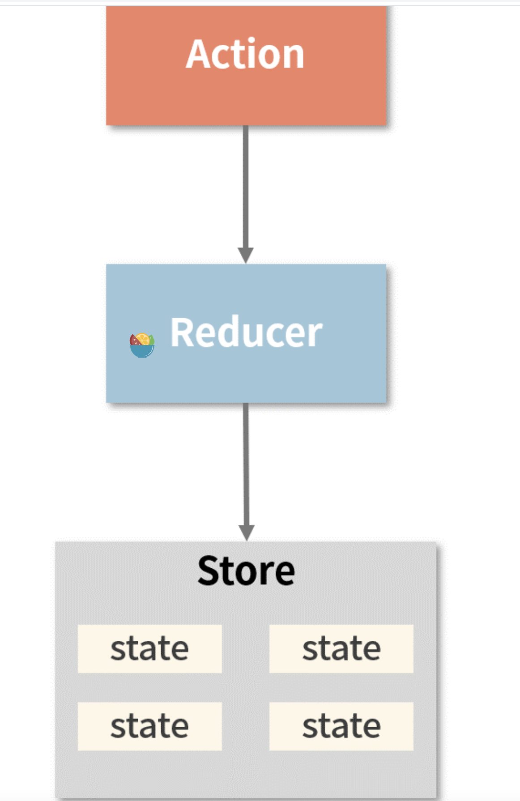

Redux 本身的工作原理是比较纯粹简单的，而 Redux 中间件，则给 Redux 添加了很多新功能。

我们先来看看中间件是怎么在 Redux 中使用的

## Redux 中间件的使用

之间将 Redux 的`createStore`函数时，能看到中间件的身影，那就是中间件相关信息，会作为`createStore`函数的一个 function 类型的参数。简单复习下`createStore`的主要逻辑

```js
import { create, applyMiddleware } from 'redux';
// ...
const store = createStore(
  reducer,
  initial_state,
  applyMiddleware(middleware1, middleware2 /* more middleware */)
);
```

可以看到，redux 对外暴露了 applyMiddleware 这个方法。applyMiddleware 接受任意个中间件作为入参，而它的返回值将会作为参数传入 createStore，这就是中间件的引入过程。

## 中间件的工作模式

中间件的引入，会为 Redux 带来什么额外功能呢？我们就已`redux-thunk`为例，看看 Redux 怎么借助中间件，处理异步 action。

上一篇在看 Redux 的主流程源码时，不难发现，Redux 的主流程源码中只有同步操作，也就是说当我们`dispatch(action)`时，`state`会被立即更新。

那如果想在 Redux 中，引入异步操作，该怎么处理呢？Redux 有很多支持异步操作的中间件，其中最容易上手的就是`Redux-Thunk`。

`Redux-Thunk`的引入就像下面这样：

```js
import thunkMiddleware from 'redux-thunk';
import { createStore, applyMiddleware } from 'redux';
import reducer from './reducers';
const store = createStore(reducer, applyMiddleware(thunkMiddleware));
```

`createStore`中，在只传入两个参数的情况下，createStore 会去检查第二个参数是否是 function 类型，若是，则认为第二个参数是“enhancer”。这里的“enhancer”是“增强器”的意思，而 applyMiddleware 包装过的中间件，正是“增强器”的一种。这也就解释了为什么上面 redux-thunk 的调用示例中，applyMiddleware 调用明明是作为 createStore 的第二个参数被传入的，却仍然能够被识别为中间件信息。

redux-thunk 带来的改变非常好理解，它允许我们以函数的形式派发一个 action，像这样：

```js
import axios from 'axios';
import thunkMiddleware from 'redux-thunk';
import { createStore, applyMiddleware } from 'redux';
import reducer from './reducers';
const store = createStore(reducer, applyMiddleware(thunkMiddleware));
//  用于发起付款的请求，并处理请求结果，由于涉及资金，我们希望能感知 请求的发送和响应的返回
//  入参是付款相关信息（包括用户账号、密码、金额）
//  注意payMoney的返回值仍然是个函数
const payMoney = (payInfo) => (dispatch) => {
  //  付款前发出准备信号
  dispatch({ type: 'payStart' });
  fetch().then((res) => {
    dispatch();
  });
  return axios
    .post('/api/payMoney', { payInfo: payInfo })
    .then((res) => {
      console.log('付款成功--', res);
      dispatch({ type: 'paySuccess' });
    })
    .catch((error) => {
      console.log('付款失败--', error);
      dispatch({ type: 'payFail' });
    });
};
const payInfo = {
  userName: '小王',
  pwd: '123',
  count: 100
};
// dispatch一个action，注意这个action是个函数
store.dispatch(payMoney(payInfo));
```

以上代码用 redux-thunk 模拟了一个付款请求的发起 → 响应过程。

这个过程单从表面上看，和普通 Redux 调用最大的不同就是 dispatch 的入参从 action 对象变成了一个函数。这就不由得让人对 thunk 中间件加持下的 Redux 工作流心生好奇，毕竟 Redux 的源码中，对 action 入参必须是一个对象，可做了强验证。而 thunk 中间件似乎巧妙地“绕开”了这层校验。那么 thunk 是怎么做到呢？

中间件在 Redux 的工作流中，是这样的：中间件会在 action 分发之后、到达 reducer 之前执行。若有多个中间件，那么 Redux 会根据它们安装的顺序，依序调用这些中间件。

中间件的执行时机，允许它在状态真正发生变化之前，结合 action 的信息做一些它想做的事情。

那么中间件又是如何“绕过” dispatch 的校验逻辑的呢？其实，“绕过”dispatch 只是咱们主观上的一个使用感受。dispatch 并非被“绕过”了，而是被“改写”了，改写它的不是别人，正是 applyMiddleware。

对于 Redux 中间件的工作模式，我们需要牢牢把握以下两点

1. 中间件的执行时机，即 action 被分发之后、reducer 触发之前；
2. 中间件的执行前提，即 applyMiddleware 将会对 dispatch 函数进行改写，使得 dispatch 在触发 reducer 之前，会首先执行对 Redux 中间件的链式调用。

## thunk 中间件做了什么

`redux-thunk`的源码非常简洁优雅

```js
// createThunkMiddleware，用于创建 thunk
function createThunkMiddleware(extraArgument) {
  //  返回值是个thunk ，它是一个函数
  return ({ dispatch, getState }) => (next) => (action) => {
    //  thunk 若感知 action 是一个函数，就会执行action
    if (typeof action === 'function') {
      return action(dispatch, getState, extraArgument);
    }
    //  若action不是一个函数，则不处理，直接放过
    return next(action);
  };
}
const thunk = createThunkMiddleware();
thunk.withExtraArgument = createThunkMiddleware();
export default thunk;
```

redux-thunk 主要做的事情，就是在拦截到 action 以后，会去检查它是否是一个函数。若 action 是一个函数，那么 redux-thunk 就会执行它并且返回执行结果；若 action 不是一个函数，那么它就不是 redux-thunk 的处理目标，直接调用 next，告诉 Redux “我这边的工作做完了”，工作流就可以继续往下走了。

thunk 的源码看了，现在看看 Redux 是怎么实现中间件机制的。

## applyMiddleware

Redux 是通过`applyMiddleware`来引入中间件的

```js
//  ...运算符，会把函数入参收敛为一个数组
export default function applyMiddleware(...middlewareList) {
  //  返回一个接受 createStore 为入参的函数
  return (createStore) => (...args) => {
    //  首先使用 createStore，创建一个store
    const store = createStore(...args);
    let dispatch = () => {
      throw new Error(`while constructing your middleware is not allowed. `);
    };
    //  middlewareAPI是中间件的入参
    const middlewareAPI = {
      getState: store.getState,
      dispatch: (...args) => dispatch(...args)
    };
    //  遍历中间件数组，调用每个中间件，并且传入middlewareAPI作为入参，得到目标函数数组chain
    const chain = middlewareList.map((middleware) => middleware(middlewareAPI));
    //  改写原有的dispatch，将chain中的函数按照顺序组合起来，
    //  调用最终组合出来的函数，传入 dispatch 作为入参
    dispatch = compose(...chain)(store.dispatch);
    //  返回一个store对象，这个store对象已经被applyMiddleware改写过了
    return {
      ...store,
      dispatch
    };
  };
}
```

这段源码，需要把握的问题是：

1. applyMiddleware 返回了一个什么样的函数？这个函数是如何与 createStore 配合工作的？
2. dispatch 函数是如何被改写的？
3. compose 函数是如何组合中间件的？

### applyMiddleware 如何同 creteStore 工作

先来看看 applyMiddleware 的返回值，它返回的是一个接收 createStore 为入参的函数。这个函数将会作为入参传递给 createStore，那么 createStore 会如何理解它呢，复习一下之前的内容

```js
function createStore(reducer, preloadedState, enhancer) {
  if (typeof preloadedState === 'function' && enhancer === 'undefined') {
    //  第二个参数被当成中间件
    enhancer = preloadedState;
    preloadedState = undefined;
  }
  // enhancer不为空时，就将原来的 createStore 作为参数传入到enhancer
  if (typeof enhancer !== 'undefined') {
    return enhancer(createStore)(reducer, preloadedState);
  }
}
```

一旦发现 enhancer 存在（对应到中间件场景下，enhancer 指的是 applyMiddleware 返回的函数），那么 createStore 内部就会直接 return 一个针对 enhancer 的调用。在这个调用中，第一层入参是 createStore，第二层入参是 reducer 和 preloadedState

同`applyMiddleware`逻辑联系一下

```js
export default function applyMiddleware(...middlewareList) {
  return (createStore) => (...args) => {
    //...
  };
}
```

结合 createStore 中对 enhancer 的处理，我们可以知道，在 applyMiddleware return 出的这个函数中，createStore 这个入参对应的是 createStore 函数本身，而 args 入参则对应的是 reducer、preloadedState，这两个参数均为 createStore 函数的约定入参。

applyMiddleware 是 enhancer 的一种，而 enhancer 的意思是“增强器”，它增强的正是 createStore 的能力。因此调用 enhancer 时，传入 createStore 及其相关的入参信息是非常必要的。

### dispatch 函数如何被改写

dispatch 函数的改写逻辑在这里

```js
const middlewareAPI = {
  getState: store.getState,
  dispatch: (...args) => dispatch(...args)
};
// 遍历中间件数组，得到目标函数的数组
const chain = middlewareList.map((middleware) => middleware(middlewareAPI));
//  改写原有dispatch
dispatch = compose(...chain)(store.dispatch);
```

上面的代码以 middlewareAPI 作为入参，逐个调用传入的 middleware，获取一个由“内层函数”组成的数组 chain；然后调用 compose 函数，将 chain 中的“内层函数”逐个组合起来，并调用最终组合出来的函数。

这里‘内层函数’，还有个`compose`，可能理解起来有点新

站在函数的视角，来看看 thunk

```js
function createThunkMiddleware(extraArgument) {
  return ({ dispatch, getState }) => (next) => (action) => {
    if (typeof action === 'function') {
      return action(dispatch, getState, extraArgument);
    }
    return next(action);
  };
}
const thunk = createThunkMiddleware();
```

createThunkMiddleware 返回的是这样的一个函数，这个函数的返回值仍然是一个函数，显然它（thunk）是一个高阶函数。事实上，按照约定，所有的 Redux 中间件都必须是高阶函数。在高阶函数中，我们习惯于将原函数称为“外层函数”，将 return 出来的函数称为“内层函数”。

而 apply 中遍历 middlewares 数组，逐个调用 middleware(middlewareAPI)，无非是为了获取中间件的内层函数。

看 thunk 源码，外层函数的主要作用是获取 dispatch、getState 这两个 API，而真正的中间件逻辑是在内层函数中包裹的。待 middlewares.map(middleware => middleware(middlewareAPI))执行完毕后，内层函数会被悉数提取至 chain 数组。

提取出 chain 数组之后，applyMiddleware 做的第一件事就是将数组中的中间件逻辑 compose 起来。

那么 compose 函数又是干嘛的呢？函数合成（组合函数）并不是 Redux 的专利，而是函数式编程中一个通用的概念。因此在 Redux 源码中，compose 函数是作为一个独立文件存在的，它具备较强的工具属性。

```js
export default function compose(...funcList) {
  if (funcList.length === 0) {
    return (arg) => arg;
  }
  if (funcList.length == 1) {
    return funcList[1];
  }
  //  若有多个函数
  return funcList.reduce((prevFunc, currentFunc) => {
    return (...args) => preFunc(currentFunc(...args));
  });
}
```

educer 方法的特点是，会对数组中的每个元素执行我们指定的函数逻辑，并将其结果汇总为单个返回值。因此 compose 调用有如下效果

```js
compose[f1, f2, f3, f4] =》 (...args) => f1(f2(f3(f4(...args))))
```

如此一来，f1、f2、f3、f4 这 4 个中间件的内层逻辑就会被组合到一个函数中去，当这个函数被调用时，f1、f2、f3、f4 将会按照顺序被依次调用。这就是“函数组合”在此处的含义。

### 中间件与面向切面编程（AOP）

中间件这个概念并非 Redux 的专利，它在软件领域由来已久，大家所熟知的 Koa、Express 这些 Node 框架中也都不乏对中间件的应用。

AOP 看作是对 OOP 的一种补充，为什么这么说呢

在 OOP 模式下，当我们想要拓展一个类的逻辑时，最常见的思路就是继承：class A 继承 class B，class B 继承 class C......这样一层一层将逻辑向下传递。

当我们想要为某几个类追加一段共同的逻辑时，可以通过修改它们共同的父类来实现，这无疑会使得公共类越来越臃肿，可我们也确实没有什么更好的办法——总不能任这些公共逻辑散落在不同的业务逻辑里吧？那将会引发更加严重的代码冗余及耦合问题。

怎么办呢？“面向切面”来救场！

既然是面向“切面”，那么首先我们要搞清楚什么是“切面”。切面是一个相对于执行流程来说的概念，以 Redux 为例，它的工作流程是这样的：



考虑这样一个需求：要求在每个 Action 被派发之后，打出一个 console.log 记录“action 被派发了”这个动作，也就是我们常说的“日志追溯”。这个需求的通用性很强、业务属性很弱，因此不适合与任何的业务逻辑耦合在一起。那我们就可以以 “切面”这种形式，把它与业务逻辑剥离开来：扩展功能在工作流中的执行节点，可以视为一个单独“切点”；我们把扩展功能的逻辑放到这个“切点”上来，形成的就是一个可以拦截前序逻辑的“切面”。也就是在`action`派发之后，但是到达`reducer`之前。

“切面”与业务逻辑是分离的，因此 AOP 是一种典型的 “非侵入式”的逻辑扩充思路。在日常开发中，像“日志追溯”“异步工作流处理”“性能打点”这类和业务逻辑关系不大的功能，我们都可以考虑把它们抽到“切面”中去做。

面向切面编程带来的利好是非常明显的。从 Redux 中间件机制中，不难看出，面向切面思想在很大程度上提升了我们组织逻辑的灵活度与干净度，帮助我们规避掉了逻辑冗余、逻辑耦合这类问题。通过将“切面”与业务逻辑剥离，我们能够专注于业务逻辑的开发，并通过“即插即用”的方式自由地组织自己想要的扩展功能。
